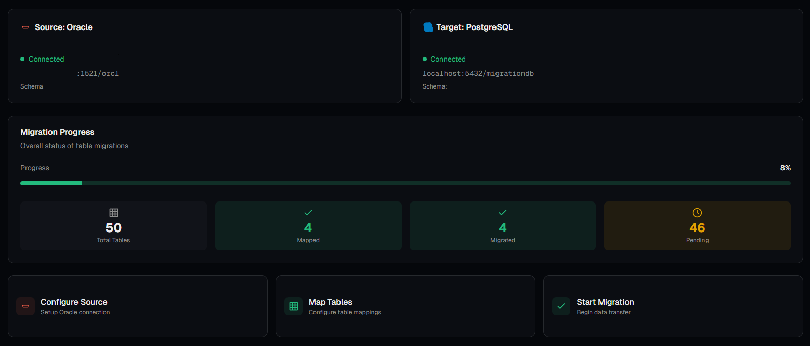
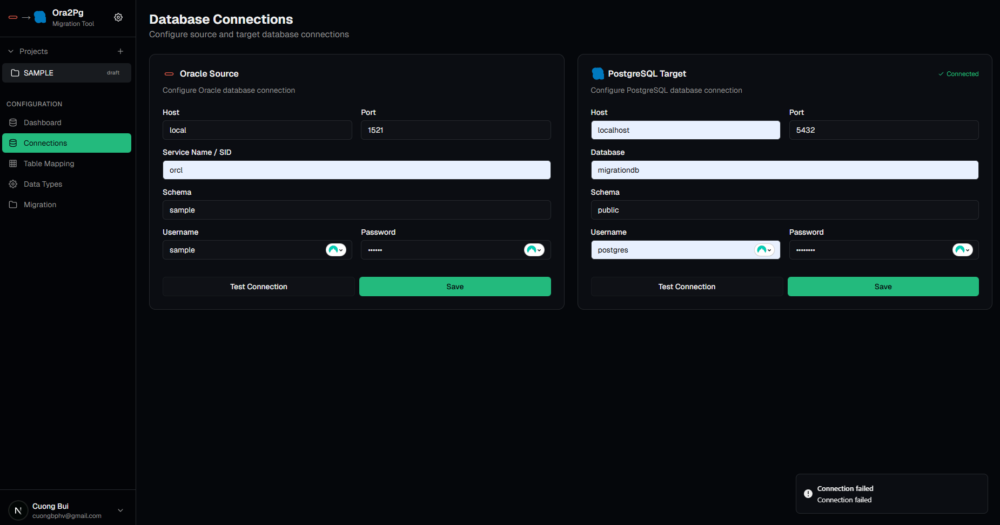
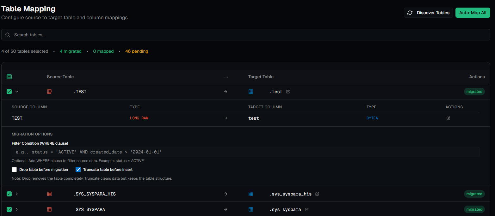
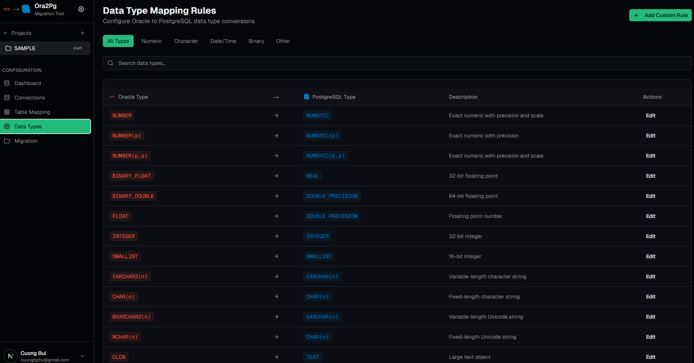
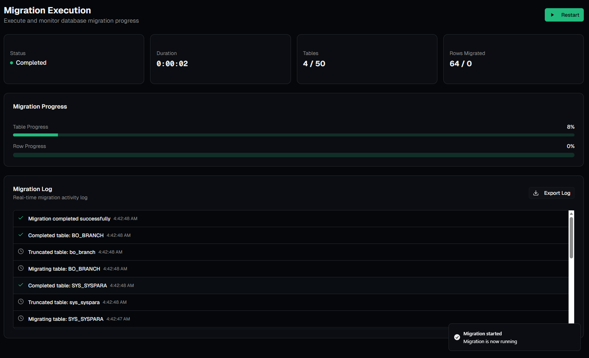

# Oracle to PostgreSQL Migration Tool

A comprehensive full-stack application for migrating data from Oracle databases to PostgreSQL databases with a modern web interface, real-time progress tracking, and advanced data type mapping.

## 📋 Table of Contents

- [Overview](#overview)
- [Features](#features)
- [Architecture](#architecture)
- [Technology Stack](#technology-stack)
- [Prerequisites](#prerequisites)
- [Installation](#installation)
- [Configuration](#configuration)
- [Deployment](#deployment)
- [Usage Guide](#usage-guide)
- [API Documentation](#api-documentation)
- [Data Type Mappings](#data-type-mappings)
- [Troubleshooting](#troubleshooting)
- [Contributing](#contributing)

## 🎯 Overview

This tool provides a complete solution for migrating Oracle databases to PostgreSQL, featuring:



- **Visual Table Mapping**: Discover and map tables with an intuitive interface
- **Real-time Migration**: Monitor progress with live updates and detailed logs
- **Advanced Data Type Handling**: Automatic conversion of Oracle types to PostgreSQL equivalents
- **Flexible Configuration**: Customizable settings for performance, logging, and migration options
- **User Management**: Secure authentication with JWT and role-based access
- **Persistent Storage**: All project data stored in PostgreSQL

## ✨ Features

### Core Features

1. **Project Management**
   - Create, view, edit, and delete migration projects
   - Project status tracking (draft, configured, running, completed, error)
   - User-specific project isolation

2. **Connection Management**
   - Oracle source database connection configuration
   - PostgreSQL target database connection setup
   - Connection testing and validation
   - Support for custom schemas

3. **Table Discovery & Mapping**
   - Automatic table discovery from source database
   - Column-level mapping with data type conversion
   - Auto-mapping functionality for quick setup
   - Manual column mapping with length/precision editing
   - Filter conditions for source data selection
   - Drop/Truncate options before migration

4. **Data Type Conversion**
   - Automatic mapping of Oracle to PostgreSQL data types
   - Support for length, precision, and scale preservation
   - Special handling for LONG RAW, TIMESTAMP, and other complex types
   - Customizable type mapping rules

5. **Migration Execution**
   - Start, pause, and resume migrations
   - Real-time progress tracking
   - Batch processing with configurable batch size
   - Transaction management with auto-commit control
   - Detailed migration logs with database persistence
   - Error handling and recovery

6. **Settings Management**
   - Performance tuning (batch size, parallel jobs, commit interval)
   - SMTP configuration for notifications
   - Logging configuration (level, retention, file output)
   - Migration options (truncate, constraints, sequences, error handling)
   - Flexible key-value storage system for future expansion

7. **Dashboard & Monitoring**
   - Real-time statistics (total, mapped, migrated, pending tables)
   - Migration progress visualization
   - Connection status indicators
   - Auto-refresh on navigation

8. **PG2PG Pipeline (PostgreSQL to PostgreSQL)**
   - Create and manage data migration pipelines
   - Multiple pipeline steps with custom transformations
   - Column-level mapping with transformation expressions
   - Filter conditions and data transformation rules
   - Import pipeline configuration from JSON files
   - Real-time execution monitoring and logging

9. **Data Type Mapping Rules**
   - View and manage Oracle to PostgreSQL type mappings
   - Create custom mapping rules
   - Override default mappings per user
   - System defaults with user customization
   - Search and filter mapping rules

10. **Migration Log Export**
    - Export migration logs to CSV format
    - Export migration logs to Excel format (.xlsx)
    - Formatted exports with color-coded log levels
    - Chronological log ordering

11. **Security**
    - JWT-based authentication
    - Password hashing with BCrypt
    - Role-based access control (admin/user)
    - User-specific data isolation
    - CORS configuration

## 🏗️ Architecture

### Project Structure

```
oracle-to-postgres-migration/
├── frontend/                    # Next.js React application
│   ├── app/                     # Next.js app router pages
│   │   ├── layout.tsx          # Root layout with Toaster
│   │   └── page.tsx            # Main application page
│   ├── components/              # React components
│   │   ├── dashboard.tsx       # Dashboard with statistics
│   │   ├── connection-form.tsx # Connection configuration
│   │   ├── table-mapping.tsx   # Table mapping interface
│   │   ├── migration-panel.tsx # Migration execution panel
│   │   ├── settings-dialog.tsx  # Settings management
│   │   ├── login-page.tsx      # Authentication UI
│   │   └── ui/                 # Reusable UI components
│   ├── lib/                    # Utilities and services
│   │   ├── api.ts              # API service with JWT
│   │   ├── auth-context.tsx    # Authentication context
│   │   ├── types.ts            # TypeScript interfaces
│   │   ├── toast.ts            # Toast notification utility
│   │   └── utils.ts            # Helper functions
│   ├── public/                 # Static assets
│   ├── Dockerfile              # Frontend Docker image
│   └── package.json           # Dependencies
│
├── backend/                    # Spring Boot REST API
│   ├── src/main/java/com/ora2pg/migration/
│   │   ├── controller/         # REST controllers
│   │   │   ├── AuthController.java
│   │   │   ├── ProjectController.java
│   │   │   ├── ConnectionController.java
│   │   │   ├── DatabaseController.java
│   │   │   ├── MigrationController.java
│   │   │   └── SettingsController.java
│   │   ├── service/           # Business logic
│   │   │   ├── AuthService.java
│   │   │   ├── ProjectService.java
│   │   │   ├── DatabaseService.java
│   │   │   ├── MigrationService.java
│   │   │   └── SettingsService.java
│   │   ├── entity/            # JPA entities
│   │   │   ├── User.java
│   │   │   ├── ProjectEntity.java
│   │   │   ├── TableMappingEntity.java
│   │   │   ├── ColumnMappingEntity.java
│   │   │   ├── ConnectionConfigEntity.java
│   │   │   ├── MigrationLogEntity.java
│   │   │   └── SettingEntity.java
│   │   ├── repository/         # JPA repositories
│   │   ├── model/             # DTOs and data models
│   │   ├── mapper/            # Entity-DTO mappers
│   │   ├── config/            # Configuration classes
│   │   ├── filter/            # JWT authentication filter
│   │   └── util/              # Utilities
│   ├── src/main/resources/
│   │   ├── application.properties
│   │   └── application-docker.properties
│   ├── Dockerfile             # Backend Docker image
│   └── pom.xml                # Maven dependencies
│
├── docker-compose.yml         # Docker Compose configuration
├── .dockerignore              # Docker ignore patterns
└── README.md                  # This file
```

### System Architecture

```
┌─────────────────┐
│   Frontend       │
│   (Next.js)     │
│   Port: 3000    │
└────────┬────────┘
         │ HTTP/REST
         │ JWT Auth
         ▼
┌─────────────────┐
│   Backend API   │
│  (Spring Boot)  │
│   Port: 8095    │
└────────┬────────┘
         │
         ├──────────────┐
         │              │
         ▼              ▼
┌─────────────┐  ┌─────────────┐
│ PostgreSQL  │  │   Oracle    │
│ (Metadata)  │  │  (Source)   │
│ Port: 5432  │  │  (External) │
└─────────────┘  └─────────────┘
         │
         ▼
┌─────────────┐
│ PostgreSQL  │
│  (Target)   │
│  (External) │
└─────────────┘
```

### Database Schema

#### Users Table
- `id` (UUID, Primary Key)
- `email` (Unique, Not Null)
- `password` (BCrypt hashed)
- `name`
- `role` (admin/user)
- `created_at`, `updated_at`

#### Projects Table
- `id` (UUID, Primary Key)
- `name`, `description`
- `status` (draft/configured/running/completed/error)
- `user_id` (Foreign Key to users)
- `created_at`, `updated_at`

#### Connection Configs Table
- `id` (UUID, Primary Key)
- `type` (oracle/postgresql)
- `host`, `port`, `database`, `schema`
- `username`, `password` (encrypted)
- `connection_type` (source/target)
- `project_id` (Foreign Key to projects)

#### Table Mappings Table
- `id` (UUID, Primary Key)
- `source_table`, `source_schema`
- `target_table`, `target_schema`
- `enabled` (Boolean)
- `status` (pending/mapped/migrated/error)
- `filter_condition` (TEXT, WHERE clause)
- `drop_before_insert` (Boolean)
- `truncate_before_insert` (Boolean)
- `project_id` (Foreign Key to projects)

#### Column Mappings Table
- `id` (UUID, Primary Key)
- `source_column`, `source_data_type`
- `source_data_length`, `source_data_precision`, `source_data_scale`
- `target_column`, `target_data_type`
- `target_data_length`, `target_data_precision`, `target_data_scale`
- `transformation`
- `nullable`, `is_primary_key`, `is_foreign_key`
- `table_mapping_id` (Foreign Key to table_mappings)

#### Migration Logs Table
- `id` (UUID, Primary Key)
- `project_id` (Foreign Key to projects)
- `timestamp`
- `level` (info/warning/error/success)
- `message`, `details` (TEXT)

#### Settings Table
- `id` (UUID, Primary Key)
- `param_key` (Unique with param_tab)
- `param_value` (TEXT)
- `param_tab` (performance/smtp/logging/migration)
- `param_type` (string/number/boolean/json)
- `description`

## 🛠️ Technology Stack

### Frontend
- **Framework**: Next.js 16.0.3
- **UI Library**: React 19.2.0
- **Language**: TypeScript
- **Styling**: Tailwind CSS
- **UI Components**: Radix UI primitives
- **Notifications**: Sonner (toast notifications)
- **Form Handling**: React Hook Form with Zod validation
- **State Management**: React hooks (useState, useEffect, Context API)
- **HTTP Client**: Fetch API with JWT token management

### Backend
- **Framework**: Spring Boot 3.2.0
- **Language**: Java 17
- **Build Tool**: Maven
- **Database**: PostgreSQL (for metadata storage)
- **ORM**: Spring Data JPA / Hibernate
- **Security**: Spring Security with JWT
- **Password Hashing**: BCrypt
- **Database Drivers**:
  - Oracle JDBC (ojdbc11)
  - PostgreSQL JDBC
- **Dependencies**:
  - Spring Web (REST APIs)
  - Spring Data JPA
  - Spring Security
  - Lombok
  - Jackson (JSON)

### Infrastructure
- **Containerization**: Docker & Docker Compose
- **Database**: PostgreSQL 12+
- **Reverse Proxy**: (Optional) Nginx for production

## 📦 Prerequisites

### For Development
- **Java**: JDK 17 or higher
- **Node.js**: 20.x or higher
- **Maven**: 3.6+ (for backend)
- **npm/pnpm**: Latest version (for frontend)
- **PostgreSQL**: 12+ (for metadata storage)
- **Oracle Database**: Access to source Oracle database
- **PostgreSQL Database**: Access to target PostgreSQL database

### For Docker Deployment
- **Docker**: 20.10 or higher
- **Docker Compose**: 2.0 or higher
- **RAM**: At least 4GB available
- **Ports**: 3000, 8095, 5432 available

## 🚀 Installation

### Option 1: Docker Compose (Recommended)

This is the easiest way to get started:

1. **Clone the repository**:
   ```bash
   git clone <repository-url>
   cd oracle-to-postgres-migration
   ```

2. **Start all services**:
   ```bash
   docker-compose up -d
   ```

3. **Check service status**:
   ```bash
   docker-compose ps
   ```

4. **View logs** (optional):
   ```bash
   docker-compose logs -f
   ```

5. **Access the application**:
   - Frontend: http://localhost:3000
   - Backend API: http://localhost:8095/api
   - PostgreSQL: localhost:5432

### Option 2: Manual Installation

#### Backend Setup

1. **Navigate to backend directory**:
   ```bash
   cd backend
   ```

2. **Build the project**:
   ```bash
   mvn clean install
   ```

3. **Configure database**:
   - Edit `src/main/resources/application.properties`
   - Update PostgreSQL connection details:
     ```properties
     spring.datasource.url=jdbc:postgresql://localhost:5432/migrationdb
     spring.datasource.username=postgres
     spring.datasource.password=postgres
     ```

4. **Configure JWT secret**:
   ```properties
   jwt.secret=your-256-bit-secret-key-for-jwt-token-generation-minimum-32-characters-long
   jwt.expiration=86400000
   ```

5. **Run the application**:
   ```bash
   mvn spring-boot:run
   ```

   The API will be available at `http://localhost:8095/api`

#### Frontend Setup

1. **Navigate to frontend directory**:
   ```bash
   cd frontend
   ```

2. **Install dependencies**:
   ```bash
   npm install
   # or
   pnpm install
   ```

3. **Configure API URL** (if backend is not on localhost:8095):
   - Create `.env.local`:
     ```env
     NEXT_PUBLIC_API_URL=http://localhost:8095/api
     ```

4. **Run the development server**:
   ```bash
   npm run dev
   # or
   pnpm dev
   ```

   The frontend will be available at `http://localhost:3000`

#### Database Setup

1. **Create PostgreSQL database**:
   ```sql
   CREATE DATABASE migrationdb;
   ```

2. **The application will automatically create tables** on first startup (using `spring.jpa.hibernate.ddl-auto=update`)

## ⚙️ Configuration

### Backend Configuration

Edit `backend/src/main/resources/application.properties`:

```properties
# Server Configuration
server.port=8095
server.servlet.context-path=/api

# PostgreSQL Database Configuration
spring.datasource.url=jdbc:postgresql://localhost:5432/migrationdb
spring.datasource.username=postgres
spring.datasource.password=postgres
spring.datasource.driver-class-name=org.postgresql.Driver

# JPA Configuration
spring.jpa.database-platform=org.hibernate.dialect.PostgreSQLDialect
spring.jpa.hibernate.ddl-auto=update
spring.jpa.show-sql=false

# JWT Configuration
jwt.secret=your-256-bit-secret-key-for-jwt-token-generation-minimum-32-characters-long
jwt.expiration=86400000

# CORS Configuration
spring.web.cors.allowed-origins=http://localhost:3000
spring.web.cors.allowed-methods=GET,POST,PUT,DELETE,OPTIONS
spring.web.cors.allowed-headers=*
spring.web.cors.allow-credentials=true

# Migration Defaults
migration.default.batch-size=1000
migration.default.parallel-jobs=4
migration.default.commit-interval=10000
```

### Frontend Configuration

Create `frontend/.env.local`:

```env
NEXT_PUBLIC_API_URL=http://localhost:8095/api
```

### Docker Configuration

Edit `docker-compose.yml` to customize:

- **JWT Secret**: Update `JWT_SECRET` environment variable
- **Database Password**: Update PostgreSQL password
- **Ports**: Change port mappings if needed
- **API URL**: Update `NEXT_PUBLIC_API_URL` for frontend

## 🚢 Deployment

### Docker Compose Deployment

1. **Production Configuration**:
   ```bash
   # Update docker-compose.yml with production settings
   # - Change default passwords
   # - Set strong JWT secret
   # - Configure environment variables
   ```

2. **Build and start**:
   ```bash
   docker-compose build
   docker-compose up -d
   ```

3. **Verify services**:
   ```bash
   docker-compose ps
   docker-compose logs
   ```

### Production Deployment Considerations

1. **Security**:
   - Use strong JWT secret (minimum 32 characters)
   - Change default database passwords
   - Enable HTTPS with reverse proxy (Nginx/Traefik)
   - Configure firewall rules
   - Use secrets management for sensitive data

2. **Database**:
   - Use external PostgreSQL instance
   - Set up regular backups
   - Configure connection pooling
   - Monitor performance

3. **Monitoring**:
   - Add health check endpoints
   - Set up logging aggregation
   - Monitor resource usage
   - Configure alerts

4. **Scaling**:
   - Use load balancer for multiple backend instances
   - Configure database connection pooling
   - Use Redis for session management (if needed)

### Manual Deployment

#### Backend

1. **Build JAR**:
   ```bash
   cd backend
   mvn clean package
   ```

2. **Run JAR**:
   ```bash
   java -jar target/migration-api-1.0.0.jar
   ```

#### Frontend

1. **Build for production**:
   ```bash
   cd frontend
   npm run build
   ```

2. **Start production server**:
   ```bash
   npm start
   ```

## 📖 Usage Guide

### Application Screenshots

#### 1. Dashboard
The dashboard provides an overview of your migration project with real-time statistics, connection status, and migration progress.


**Key Features:**
- Project information and status indicator
- Source (Oracle) and Target (PostgreSQL) connection status cards
- Migration progress overview with visual progress bars
- Statistics cards showing total, mapped, migrated, and pending tables
- Quick action cards for common tasks

#### 2. Connection Configuration
Configure your Oracle source and PostgreSQL target database connections with built-in connection testing functionality.



**Key Features:**
- Separate forms for Source (Oracle) and Target (PostgreSQL) connections
- Connection testing with real-time feedback
- Support for custom schemas and connection strings
- Secure password storage
- Connection status indicators

#### 3. Table Mapping
Discover tables from your source database and map them to target tables with comprehensive column-level configuration options.



**Key Features:**
- Table discovery from source database
- Visual source-to-target table mapping
- Column-level mapping with data type display (including length/precision)
- Select all/deselect all functionality
- Edit capabilities for table and column names
- Data type editing with length/precision controls
- Filter conditions (WHERE clause) for source data
- Drop/Truncate options before migration
- Table status indicators (pending/mapped/migrated/error)

#### 4. Data Type Rules
View and understand the comprehensive automatic data type mappings from Oracle to PostgreSQL with detailed descriptions.



**Key Features:**
- Complete data type mapping reference table
- Oracle to PostgreSQL type conversions
- Transformation hints and warnings
- Search and filter functionality
- Detailed descriptions for each mapping

#### 5. Migration Execution
Monitor migration progress in real-time with detailed logs, statistics, and progress tracking.



**Key Features:**
- Real-time migration status and duration
- Table and row progress tracking with progress bars
- Detailed migration logs with timestamps
- Log level indicators (info/warning/error/success)
- Export log functionality
- Start/pause/resume migration controls
- Statistics: tables completed, rows migrated, duration

### Getting Started

1. **Access the application**: Navigate to http://localhost:3000

2. **Register/Login**:
   - Click "Sign up" to create a new account
   - Or login with existing credentials

3. **Create a Project**:
   - Click "New Project" in the sidebar
   - Enter project name and description
   - Click "Create"

4. **Configure Connections**:
   - Go to "Connections" tab
   - **Source (Oracle)**:
     - Enter Oracle database connection details
     - Click "Test Connection" to verify
     - Click "Save Source Connection"
   - **Target (PostgreSQL)**:
     - Enter PostgreSQL database connection details
     - Click "Test Connection" to verify
     - Click "Save Target Connection"

5. **Discover and Map Tables**:
   - Go to "Table Mapping" tab
   - Click "Discover Tables" to find all tables in source database
   - Review auto-mapped tables
   - Edit table/column mappings as needed:
     - Click edit icon to modify target table name
     - Expand table to edit column mappings
     - Adjust data types, lengths, precision as needed
   - Configure migration options:
     - **Filter Condition**: Add WHERE clause to filter source data
     - **Drop Before Insert**: Drop target table before migration
     - **Truncate Before Insert**: Clear target table data before migration

6. **Configure Settings** (Optional):
   - Click settings icon in sidebar
   - Adjust performance settings (batch size, parallel jobs)
   - Configure logging options
   - Set migration preferences

7. **Start Migration**:
   - Go to "Migration Execution" tab
   - Review migration summary
   - Click "Start Migration"
   - Monitor progress in real-time
   - View detailed logs

8. **Monitor Progress**:
   - View dashboard for overall statistics
   - Check migration panel for detailed progress
   - Review migration logs for any issues

### Advanced Features

#### Filter Conditions

Add WHERE clauses to filter source data during migration:

```sql
-- Example: Only migrate active records
status = 'ACTIVE'

-- Example: Migrate records from specific date
created_date > '2024-01-01' AND region = 'US'

-- Example: Migrate specific IDs
id IN (1, 2, 3, 4, 5)
```

#### Data Type Customization

When editing column mappings:
- **VARCHAR/CHAR**: Edit length parameter
- **NUMERIC**: Edit precision and scale
- **TIMESTAMP**: Edit precision if needed

#### Migration Options

- **Drop Before Insert**: Completely removes target table and recreates it
- **Truncate Before Insert**: Clears data but keeps table structure
- **Auto Commit**: Enable for immediate commits, disable for batch commits

### PG2PG Pipeline Setup

The PG2PG (PostgreSQL to PostgreSQL) feature allows you to create data migration pipelines between PostgreSQL databases with advanced transformation capabilities.

#### Creating a Pipeline Manually

1. **Navigate to PG2PG Pipeline**:
   - Click "PG2PG Pipeline" in the sidebar
   - Click "New Pipeline" to create a new pipeline
   - Enter pipeline name and description

2. **Configure Connections**:
   - Go to "Connections" tab
   - **Source (PostgreSQL)**: Configure source database connection
   - **Target (PostgreSQL)**: Configure target database connection
   - Test both connections to ensure they work

3. **Add Pipeline Steps**:
   - Go to "Steps" tab
   - Click the "+" button to add a new step
   - Configure step details:
     - **Source Schema/Table**: Select source table
     - **Target Schema/Table**: Specify target table name
     - **Description**: Add step description
   - Configure column mappings:
     - Click "Edit" on a step to open the mapping editor
     - Map source columns to target columns
     - Set data types for target columns
     - Add transformation expressions:
       - **Direct**: Direct column copy
       - **Static**: Constant value
       - **Function**: SQL function call
       - **Case-When**: Conditional logic
       - **Subquery**: Subquery transformation
       - **Type-Cast**: Data type conversion
       - **Concat**: String concatenation
   - Configure filters:
     - Enable filter if needed
     - Add WHERE clause condition
     - Add filter description
   - Configure options:
     - **Disable Triggers**: Disable triggers during migration
     - **Disable Constraints**: Disable constraints during migration

4. **Save and Execute**:
   - Click "Save" to save pipeline configuration
   - Click "Start Pipeline" to begin execution
   - Monitor progress in the "Logs" tab

#### Importing Pipeline from JSON

You can import pipeline steps from a JSON configuration file:

1. **Prepare JSON File**:
   Create a JSON file with the following structure:
   ```json
   {
     "source_table": "source_table_name",
     "source_schema": "source_schema",
     "target_table": "target_table_name",
     "target_schema": "target_schema",
     "description": "Step description",
     "filter": {
       "enabled": true,
       "where_clause": "column = 'value'",
       "description": "Filter description"
     },
     "options": {
       "disable_triggers": true,
       "disable_constraints": true
     },
     "column_mappings": {
       "source_column": {
         "target_column": "target_column_name",
         "target_type": "VARCHAR(255)",
         "description": "Column description",
         "transformation": "optional SQL expression"
       }
     },
     "indexes": [
       {
         "name": "idx_name",
         "columns": ["column1", "column2"],
         "type": "INDEX"
       }
     ],
     "constraints": []
   }
   ```

2. **Import JSON**:
   - Open your pipeline in the builder
   - Click "Import JSON" button
   - Select your JSON file
   - The system will:
     - Parse the JSON configuration
     - Create a new pipeline step
     - Map all columns and transformations
     - Save to the database

3. **Review and Edit**:
   - Review the imported step
   - Edit any mappings or transformations as needed
   - Save the pipeline

#### Pipeline Step Configuration

**Column Transformations**:
- **Direct**: `source_column` → Direct copy
- **Static**: `'constant_value'` → Fixed value
- **Function**: `function_name(column)` → Function call
- **Case-When**: `CASE WHEN condition THEN value ELSE other END`
- **Subquery**: `(SELECT ... FROM ... WHERE ...)`
- **Type-Cast**: `column::target_type`
- **Concat**: `column1 || ' ' || column2`

**Example Transformations**:
```sql
-- Static value
'ACTIVE'

-- Case-When
CASE WHEN status = 'A' THEN 'ACTIVE' ELSE 'INACTIVE' END

-- Subquery lookup
(SELECT name FROM lookup_table WHERE id = source.id)

-- Function call
UPPER(source_column)

-- Type conversion
source_column::VARCHAR(50)
```

### Data Type Rule Configuration

Configure custom Oracle to PostgreSQL data type mapping rules:

1. **Access Data Type Rules**:
   - Navigate to "Data Type Rules" from the sidebar
   - View all default and custom mapping rules

2. **View Rules**:
   - Browse default system rules (30+ mappings)
   - Filter by category (Numeric, Character, Date/Time, Binary, Other)
   - Search for specific data types

3. **Create Custom Rule**:
   - Click "Add Custom Rule" button
   - Fill in the form:
     - **Oracle Type**: The Oracle data type (e.g., `VARCHAR2(255)`)
     - **PostgreSQL Type**: Target PostgreSQL type (e.g., `VARCHAR(255)`)
     - **Description**: Rule description
     - **Transformation Hint**: Optional hint about data transformation
   - Click "Create Rule"
   - Custom rules take precedence over defaults

4. **Edit Custom Rule**:
   - Click "Edit" on a custom rule
   - Modify the mapping configuration
   - Click "Update Rule"
   - Note: System default rules cannot be edited

5. **Delete Custom Rule**:
   - Click the delete icon on a custom rule
   - Confirm deletion
   - The system will fall back to default rules

**Rule Precedence**:
- Custom user rules override system defaults
- Rules are matched by Oracle type name
- First matching rule is used

### Export Migration Logs

Export migration logs to CSV or Excel for analysis and reporting:

1. **Access Migration Logs**:
   - Navigate to "Migration Execution" tab
   - View real-time migration logs in the log panel

2. **Export Options**:
   - Click "Export Log" dropdown button
   - Choose export format:
     - **Export as Excel (.xlsx)**: Formatted Excel file with colors
     - **Export as CSV (.csv)**: Comma-separated values file

3. **Excel Export Features**:
   - Color-coded log levels:
     - **Error**: Red background
     - **Warning**: Yellow background
     - **Success**: Green background
     - **Info**: Light blue background
   - Formatted headers with borders
   - Auto-sized columns
   - All log details included

4. **CSV Export Features**:
   - UTF-8 encoding with BOM (Excel compatible)
   - Proper CSV escaping for special characters
   - Chronological ordering (oldest to newest)
   - All columns: Timestamp, Level, Message, Details

5. **File Download**:
   - File automatically downloads to your browser
   - Filename format: `migration_logs_{projectId}.{csv|xlsx}`
   - Open in Excel, Google Sheets, or any CSV viewer

**Export Contents**:
- **Timestamp**: When the log entry was created
- **Level**: Log level (info, warning, error, success)
- **Message**: Log message
- **Details**: Additional log details (if available)

## 📡 API Documentation

### Authentication Endpoints

#### POST `/api/auth/login`
Login and receive JWT token.

**Request**:
```json
{
  "email": "user@example.com",
  "password": "password123"
}
```

**Response**:
```json
{
  "token": "eyJhbGciOiJIUzI1NiIsInR5cCI6IkpXVCJ9...",
  "email": "user@example.com",
  "name": "User Name",
  "role": "user",
  "id": "uuid"
}
```

#### POST `/api/auth/register`
Register a new user account.

**Request**:
```json
{
  "email": "user@example.com",
  "password": "password123",
  "name": "User Name",
  "role": "user"
}
```

### Project Endpoints (Protected)

#### GET `/api/projects`
Get all projects for the authenticated user.

**Headers**: `Authorization: Bearer <token>`

**Response**: Array of Project objects

#### GET `/api/projects/{id}`
Get project details by ID.

#### POST `/api/projects`
Create a new project.

**Request**:
```json
{
  "name": "Project Name",
  "description": "Project Description"
}
```

#### PUT `/api/projects/{id}`
Update project.

#### DELETE `/api/projects/{id}`
Delete project.

#### POST `/api/projects/{id}/connections/{type}`
Save connection configuration.

**Path Parameters**:
- `type`: `source` or `target`

**Request**:
```json
{
  "type": "oracle",
  "host": "localhost",
  "port": 1521,
  "database": "ORCL",
  "schema": "SCHEMA_NAME",
  "username": "username",
  "password": "password"
}
```

#### PUT `/api/projects/{id}/table-mappings`
Save table mappings.

**Request**: Array of TableMapping objects

### Connection Endpoints

#### POST `/api/connections/test`
Test database connection (public endpoint).

**Request**: ConnectionConfig object

**Response**:
```json
{
  "success": true,
  "message": "Connection successful"
}
```

### Database Endpoints (Protected)

#### POST `/api/database/discover-tables`
Discover tables from source database.

**Request**:
```json
{
  "connection": { /* ConnectionConfig */ },
  "schema": "SCHEMA_NAME"
}
```

**Response**: Array of TableInfo objects with columns

#### POST `/api/database/auto-map`
Auto-map source tables to target.

**Request**:
```json
{
  "sourceTables": [ /* TableInfo array */ ],
  "targetSchema": "public"
}
```

**Response**: Array of TableMapping objects

### Migration Endpoints (Protected)

#### POST `/api/migration/start/{projectId}`
Start migration for a project.

**Request** (optional):
```json
{
  "batchSize": 1000,
  "commitInterval": 10000,
  "parallelJobs": 4,
  "autoCommit": false
}
```

#### GET `/api/migration/progress/{projectId}`
Get migration progress.

**Response**:
```json
{
  "projectId": "uuid",
  "status": "running",
  "startTime": "2024-01-01T00:00:00",
  "totalTables": 10,
  "completedTables": 5,
  "totalRows": 100000,
  "migratedRows": 50000,
  "currentTable": "TABLE_NAME",
  "logs": [ /* MigrationLog array */ ]
}
```

#### POST `/api/migration/pause/{projectId}`
Pause running migration.

#### POST `/api/migration/resume/{projectId}`
Resume paused migration.

### Settings Endpoints (Protected)

#### GET `/api/settings`
Get application settings.

**Response**: AppSettings object

#### PUT `/api/settings`
Update application settings.

**Request**: AppSettings object

### PG2PG Pipeline Endpoints (Protected)

#### GET `/api/pg2pg/pipelines`
Get all pipelines for the authenticated user.

**Headers**: `Authorization: Bearer <token>`

**Response**: Array of Pipeline objects

#### GET `/api/pg2pg/pipelines/{id}`
Get pipeline details by ID.

#### POST `/api/pg2pg/pipelines`
Create a new pipeline.

**Request**:
```json
{
  "name": "Pipeline Name",
  "description": "Pipeline Description"
}
```

#### PUT `/api/pg2pg/pipelines/{id}`
Update pipeline configuration.

#### DELETE `/api/pg2pg/pipelines/{id}`
Delete pipeline.

#### POST `/api/pg2pg/pipelines/{pipelineId}/steps`
Add a step to pipeline.

**Request**: PipelineStep object with column mappings

#### POST `/api/pg2pg/pipelines/{pipelineId}/import-json`
Import pipeline step from JSON file.

**Request**: `multipart/form-data` with `file` field containing JSON

**Response**: Created PipelineStep object

**Example JSON Structure**:
```json
{
  "source_table": "source_table",
  "source_schema": "schema",
  "target_table": "target_table",
  "target_schema": "schema",
  "description": "Step description",
  "filter": {
    "enabled": true,
    "where_clause": "column = 'value'"
  },
  "options": {
    "disable_triggers": true,
    "disable_constraints": true
  },
  "column_mappings": {
    "source_column": {
      "target_column": "target_column",
      "target_type": "VARCHAR(255)",
      "transformation": "optional SQL expression"
    }
  }
}
```

#### PUT `/api/pg2pg/pipelines/steps/{stepId}`
Update a pipeline step.

#### DELETE `/api/pg2pg/pipelines/steps/{stepId}`
Delete a pipeline step.

#### POST `/api/pg2pg/pipelines/{pipelineId}/connections/{type}`
Save pipeline connection (source or target).

**Path Parameters**:
- `type`: `source` or `target`

#### POST `/api/pg2pg/pipelines/{pipelineId}/start`
Start pipeline execution.

#### POST `/api/pg2pg/pipelines/{pipelineId}/stop`
Stop/pause pipeline execution.

#### GET `/api/pg2pg/pipelines/{pipelineId}/logs`
Get pipeline execution logs.

**Query Parameters**:
- `executionId` (optional): Filter by execution ID

#### GET `/api/pg2pg/pipelines/{pipelineId}/executions`
Get all executions for a pipeline.

### Data Type Mapping Rules Endpoints (Protected)

#### GET `/api/data-type-rules`
Get all mapping rules (custom + defaults) for the authenticated user.

**Response**: Array of DataTypeMappingRule objects

#### GET `/api/data-type-rules/custom`
Get only custom rules for the authenticated user.

#### GET `/api/data-type-rules/defaults`
Get system default rules.

#### POST `/api/data-type-rules`
Create a custom mapping rule.

**Request**:
```json
{
  "oracleType": "VARCHAR2(255)",
  "postgresType": "VARCHAR(255)",
  "description": "Variable-length string",
  "transformationHint": "Optional transformation hint"
}
```

#### PUT `/api/data-type-rules/{id}`
Update a custom mapping rule.

**Request**: DataTypeMappingRule object

#### DELETE `/api/data-type-rules/{id}`
Delete a custom mapping rule.

### Migration Log Export Endpoints (Protected)

#### GET `/api/migration/logs/{projectId}/export/csv`
Export migration logs to CSV format.

**Response**: CSV file download with UTF-8 BOM

**Content-Type**: `text/csv; charset=UTF-8`

**Filename**: `migration_logs_{projectId}.csv`

#### GET `/api/migration/logs/{projectId}/export/excel`
Export migration logs to Excel format.

**Response**: Excel (.xlsx) file download

**Content-Type**: `application/vnd.openxmlformats-officedocument.spreadsheetml.sheet`

**Filename**: `migration_logs_{projectId}.xlsx`

**Features**:
- Color-coded log levels
- Formatted headers
- Auto-sized columns
- All log details included

## 🔄 Data Type Mappings

The application provides both default and customizable data type mapping rules. Default rules are automatically initialized, and users can create custom rules to override defaults.

### Default Mappings

The application automatically maps Oracle data types to PostgreSQL:

| Oracle Type | PostgreSQL Type | Notes |
|------------|----------------|-------|
| `NUMBER` | `NUMERIC` | Preserves precision and scale |
| `NUMBER(p)` | `NUMERIC(p)` | With precision |
| `NUMBER(p,s)` | `NUMERIC(p,s)` | With precision and scale |
| `VARCHAR2(n)` | `VARCHAR(n)` | Preserves length |
| `VARCHAR2` | `TEXT` | If no length specified |
| `NVARCHAR2(n)` | `VARCHAR(n)` | Unicode support |
| `CHAR(n)` | `CHAR(n)` | Preserves length |
| `NCHAR(n)` | `CHAR(n)` | Unicode support |
| `CLOB` | `TEXT` | Large text |
| `NCLOB` | `TEXT` | Unicode large text |
| `LONG` | `TEXT` | Legacy large text |
| `DATE` | `TIMESTAMP` | Date and time |
| `TIMESTAMP` | `TIMESTAMP` | With precision |
| `TIMESTAMP(n)` | `TIMESTAMP(n)` | Preserves precision |
| `BLOB` | `BYTEA` | Binary large object |
| `RAW(n)` | `BYTEA` | Variable binary |
| `LONG RAW` | `BYTEA` | Large binary (handles hex strings) |
| `BFILE` | `BYTEA` | External binary file |
| `BINARY_FLOAT` | `REAL` | 32-bit floating point |
| `BINARY_DOUBLE` | `DOUBLE PRECISION` | 64-bit floating point |
| `FLOAT` | `DOUBLE PRECISION` | Floating point |
| `INTEGER` | `INTEGER` | Integer |
| `SMALLINT` | `SMALLINT` | Small integer |
| `BOOLEAN` | `BOOLEAN` | Boolean |
| `ROWID` | `VARCHAR(18)` | Row identifier |
| `UROWID` | `VARCHAR(4000)` | Universal row identifier |
| `XMLTYPE` | `XML` | XML data |

### Special Handling

- **LONG RAW**: Automatically converts hex strings to binary data
- **TIMESTAMP**: Handles Oracle TIMESTAMP types with proper conversion
- **VARCHAR without length**: Maps to TEXT for PostgreSQL compatibility
- **NUMBER without precision**: Maps to NUMERIC without constraints

### Custom Mapping Rules

Users can create custom data type mapping rules that override system defaults:

1. **Rule Priority**: Custom rules take precedence over defaults
2. **User-Specific**: Each user can have their own custom rules
3. **Rule Matching**: Rules are matched by Oracle type name
4. **Edit/Delete**: Custom rules can be edited or deleted; defaults are read-only

**Example Custom Rule**:
- Oracle Type: `CUSTOM_TYPE`
- PostgreSQL Type: `TEXT`
- Description: "Custom type mapping"
- Transformation Hint: "May require data validation"

## 🐛 Troubleshooting

### Common Issues

#### Services Won't Start

1. **Check port availability**:
   ```bash
   # Windows
   netstat -ano | findstr :3000
   netstat -ano | findstr :8095
   netstat -ano | findstr :5432
   
   # Linux/Mac
   lsof -i :3000
   lsof -i :8095
   lsof -i :5432
   ```

2. **Check Docker logs**:
   ```bash
   docker-compose logs backend
   docker-compose logs frontend
   docker-compose logs postgres
   ```

#### Database Connection Errors

1. **Verify PostgreSQL is running**:
   ```bash
   docker-compose ps postgres
   ```

2. **Check connection details** in `application.properties`

3. **Verify database exists**:
   ```sql
   \l  -- List databases
   ```

#### Frontend Can't Connect to Backend

1. **Verify backend is running**:
   ```bash
   curl http://localhost:8095/api/auth/login
   ```

2. **Check CORS configuration** in `application.properties`

3. **Verify API URL** in frontend `.env.local`

#### JWT Authentication Errors

1. **Check JWT secret** is set and at least 32 characters

2. **Verify token** is included in requests:
   ```javascript
   // Check browser console for token
   localStorage.getItem('auth_token')
   ```

3. **Check token expiration** (default: 24 hours)

#### Migration Errors

1. **Check Oracle connection**:
   - Verify Oracle database is accessible
   - Check network connectivity
   - Verify credentials

2. **Check PostgreSQL connection**:
   - Verify target database exists
   - Check user permissions
   - Verify schema exists

3. **Review migration logs**:
   - Check migration panel for detailed errors
   - Review database logs
   - Check application logs

#### Data Type Conversion Issues

1. **Check column mappings**:
   - Verify data types are correctly mapped
   - Check length/precision settings
   - Review special type handling (LONG RAW, TIMESTAMP)

2. **Manual adjustment**:
   - Edit column mappings in Table Mapping view
   - Adjust data types as needed
   - Re-run migration

### Performance Issues

1. **Adjust batch size** in Settings:
   - Smaller batches for large rows
   - Larger batches for small rows

2. **Tune commit interval**:
   - More frequent commits for safety
   - Less frequent for performance

3. **Monitor database connections**:
   - Check connection pool settings
   - Monitor active connections

## 🤝 Contributing

### Development Setup

1. **Fork the repository**

2. **Create a feature branch**:
   ```bash
   git checkout -b feature/your-feature-name
   ```

3. **Make changes and test**:
   - Follow code style guidelines
   - Add tests for new features
   - Update documentation

4. **Commit changes**:
   ```bash
   git commit -m "Add: description of changes"
   ```

5. **Push and create Pull Request**

### Code Style

- **Backend**: Follow Java conventions, use Lombok for boilerplate
- **Frontend**: Follow TypeScript/React best practices, use functional components
- **Documentation**: Update README and code comments

## 📝 License

This project is part of the Oracle to PostgreSQL Migration Tool.

## 📞 Support

For issues or questions:
- Check this README
- Review application logs
- Check GitHub issues (if applicable)

---

**Built with ❤️ for seamless database migration**

